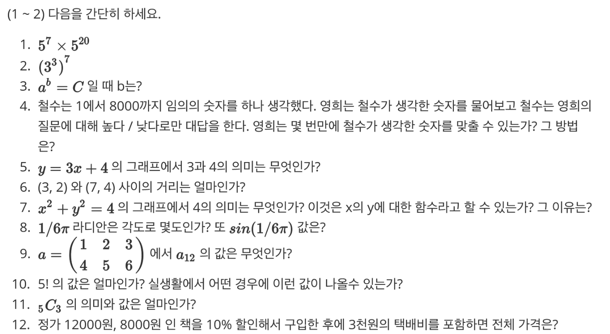

1. 5^27
2. 3^21

3. log_a-C (로그 a의 C)

4. 최대 4000번을 질의응답하면 알 수 있다.
   1. 1~8000 숫자중 가운데 숫자인 4000을 부르고 높다/낮다를 통해
   2. 높으면 4000~8000인 수를 부르거나
   3. 낮으면 1~4000인 수를 부른다.
   4. 위 2, 3 번 과정을 최대 3999번 더 반복하면 반드시 알 수 있다.
   
5. 각각 x 절편과, y 절편을 의미한다.
6. root((7-3))^2 + (4-2)^2) = root(16 + 4) = 2root(5)

7. 원의 반지름의 제곱 수를 의미한다.
8. ㄹ
9. 1
10. 120, 처음 뵌 5명이서 명함을 주고받을 때이다.
11. 어떤 5개의 것들이 있을 때, 이들 중 3개를 중복되지않게 뽑아 나올 수 있는 경우의 수
    1. 10이다.
12. (12000 + 8000)*0.9 + 3000 = 21000